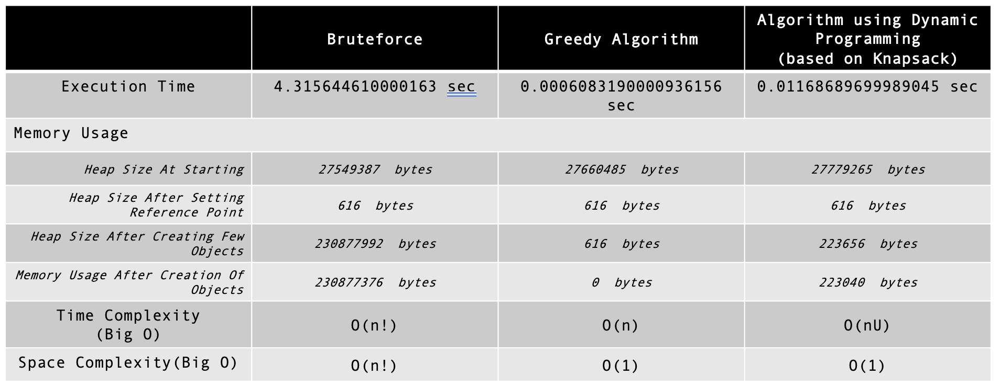

<div id="top"></div>

<!-- PROJECT SHIELDS -->
<!--
*** I'm using markdown "reference style" links for readability.
*** Reference links are enclosed in brackets [ ] instead of parentheses ( ).
*** See the bottom of this document for the declaration of the reference variables
*** for contributors-url, forks-url, etc. This is an optional, concise syntax you may use.
*** https://www.markdownguide.org/basic-syntax/#reference-style-links
-->

[![oc-project-shield][oc-project-shield]][oc-project-url]
[![algo-shield][algo-shield]][oc-project-url]
[![big-o-shield][big-o-shield]][oc-project-url]
[![finance-shield][finance-shield]][oc-project-url]
[![brute-force-shield][brute-force-shield]][oc-project-url]
[![greedy-shield][greedy-shield]][oc-project-url]
[![dynamic-programming-shield][dynamic-programming-shield]][oc-project-url]
[![knap-sack-shield][knap-sack-shield]][oc-project-url]
<!-- PROJECT LOGO -->
<br />
<div align="center">

<h1 align="center">OC - PROJECT N°7 - AlgoInvest & Trade - Solve problems using algorithms </h1>

  <p align="center">
AlgoInvest&Trade, a financial company specializing in investment. The company seeks to optimize its investment strategies using algorithms, in order to generate more profits for its clients.    <br />

  </p>
</div>


<a href="https://images.unsplash.com/photo-1526374965328-7f61d4dc18c5?ixlib=rb-4.0.3&ixid=MnwxMjA3fDB8MHxwaG90by1wYWdlfHx8fGVufDB8fHx8&auto=format&fit=crop&w=1470&q=80"><small>By Markus Spiske</small></a>

<!-- ABOUT THE PROJECT -->

## Project Overview
### Goal:
- Design an algorithm that will maximize the profit made by our clients after two years of investment. Your algorithm should suggest a list of the most profitable stocks we should buy to maximize a client's profit after two years.

### We have the following constraints:
- Each share can only be purchased once.
- We cannot buy a fractional share.
- We can spend a maximum of 500 euros per customer. 

### Datasets:
- data.csv: list of 20 stocks
- data2.csv: list of 1000 stocks
- data3.csv: list of 1000 stocks


<p align="right">(<a href="#top">back to top</a>)</p>

## Built With & Tools

* Python
* Itertools
* Pandas
* Timeit
* Guppy

<p align="right">(<a href="#top">back to top</a>)</p>


<!-- GETTING STARTED -->

## Getting Started

### Clone the repo

   ```sh
   git clone https://github.com/Jliezed/oc_project_7_algo_and_invest.git
   ```

### Run the script with a virtual environment:

Install venv library (if not yet in your computer)

   ```sh
   pip install venv
   ```

Create a virtual environment

   ```sh
   python -m venv env
   ```

Activate the virtual environment

   ```sh
   source env/bin/activate
   ```

Install packages using requirements.txt

   ```sh
   pip install -r requirements.txt
   ```

Run a script

   ```sh
   python bruteforce.py
   python optimized_dynamic_programming.py
   python optimized_glouton.py
   ```

<p align="right">(<a href="#top">back to top</a>)</p>


## Results
### Bruteforce algorithm
- Bruteforce algorithm tests all the possible combinations of stocks to buy. 
- The algorithm is very slow and does not allow to test the 1000 stocks dataset.
- Big O:
  - Time complexity: O(n!)
  - Space complexity: O(n!)

### Greedy algorithm
- Greedy algorithm involves making locally optimal choices at each step with the hope of finding a global optimum solution.
- It is a simple algorithm that does not guarantee the best result. 
- The algorithm is very fast and allows to test the 1000 stocks dataset.
- Big O:
  - Time complexity: O(n)
  - Space complexity: O(1)

### Dynamic programming algorithm (based on Knapsack)
- Dynamic programming is a technique for solving problems by breaking them down into smaller subproblems
- Solving each subproblem only once, and storing the results for future use. 
- It is a complex algorithm that guarantees the best result.
- The algorithm is very fast and allows to test the 1000 stocks dataset and more.
- Big O:
  - Time complexity: O(nU)
  - Space complexity: O(1)

### Comparison of the three algorithms



<p align="right">(<a href="#top">back to top</a>)</p>


<!-- MARKDOWN LINKS & IMAGES -->
<!-- https://www.markdownguide.org/basic-syntax/#reference-style-links -->

[oc-project-shield]: https://img.shields.io/badge/OPENCLASSROOMS-PROJECT-blueviolet?style=for-the-badge
[topic-algo-shield]: https://img.shields.io/badge/TOPICS-ALGORITHMS-blue?style=for-the-badge
[algo-shield]: https://img.shields.io/badge/-ALGORITHMS-blue?style=for-the-badge
[big-o-shield]: https://img.shields.io/badge/-BIG%20O-blue?style=for-the-badge
[finance-shield]: https://img.shields.io/badge/-FINANCE-blue?style=for-the-badge
[brute-force-shield]: https://img.shields.io/badge/-BRUTE%20FORCE-blue?style=for-the-badge
[greedy-shield]: https://img.shields.io/badge/-GREEDY-blue?style=for-the-badge
[dynamic-programming-shield]: https://img.shields.io/badge/-DYNAMIC%20PROGRAMMING-blue?style=for-the-badge
[knap-sack-shield]: https://img.shields.io/badge/-KNAPSACK-blue?style=for-the-badge
[oc-project-url]: https://openclassrooms.com/fr/paths/518-developpeur-dapplication-python
